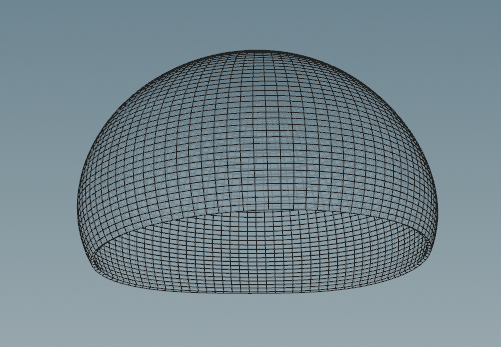
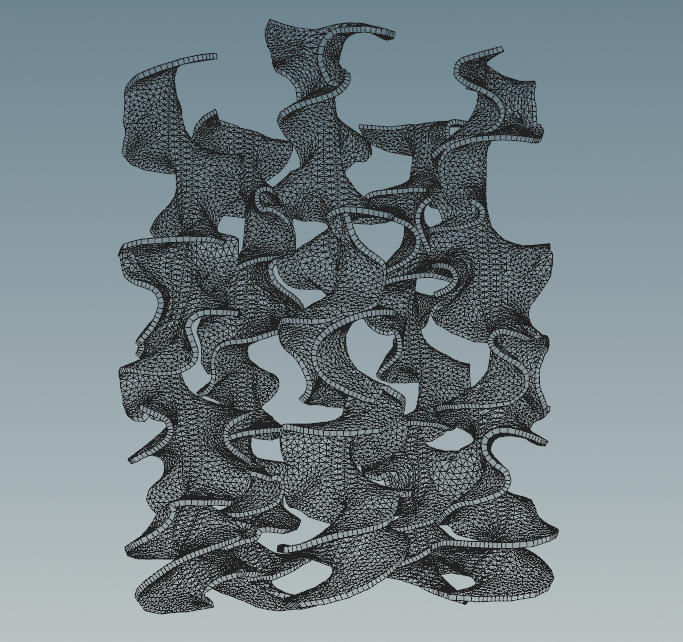
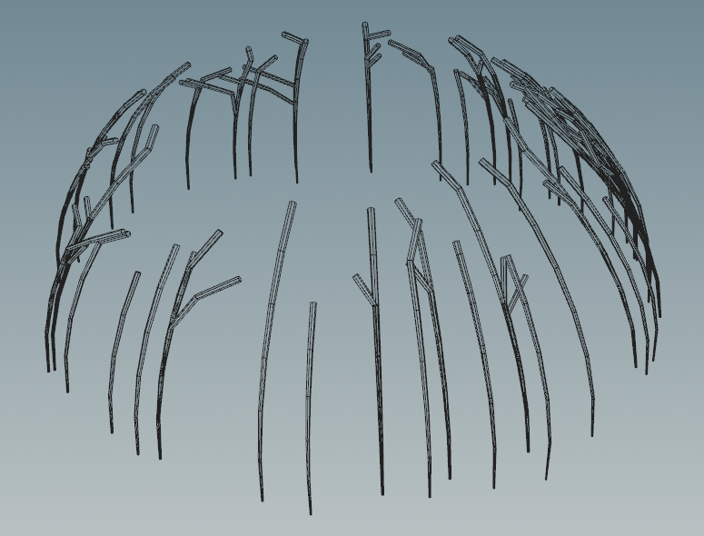
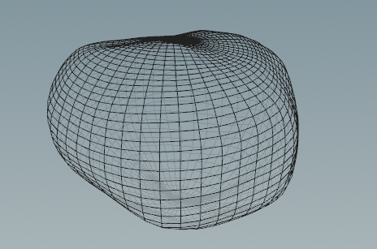
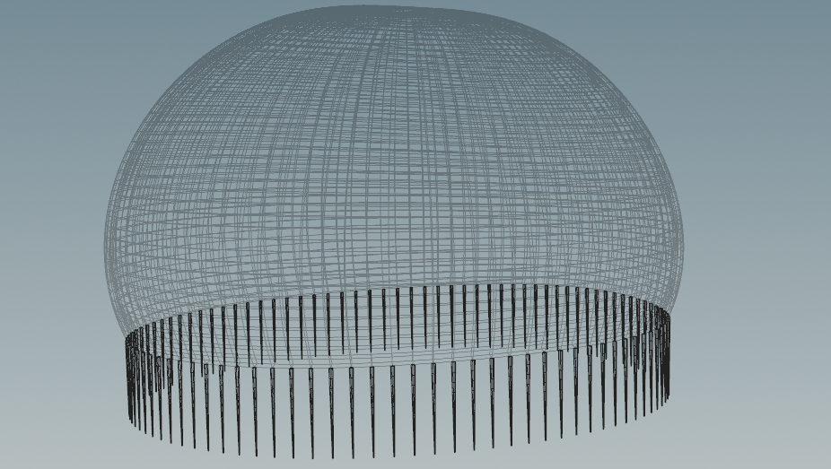
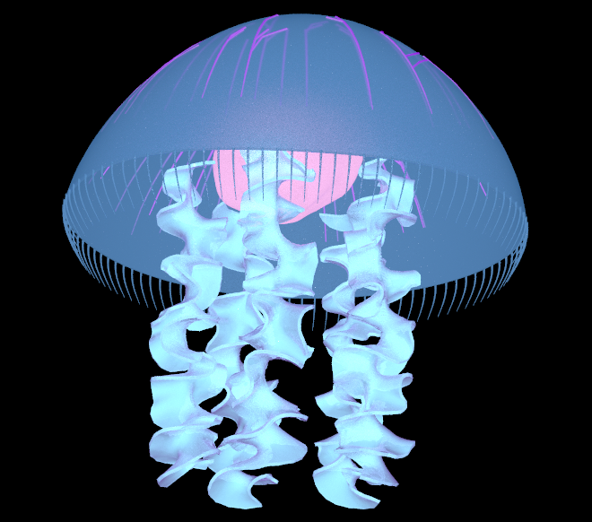
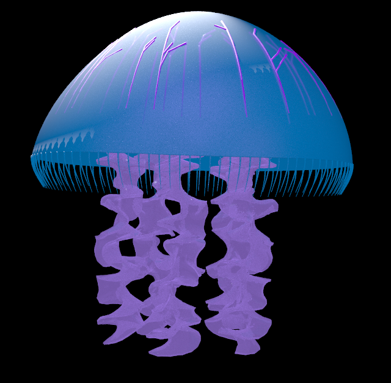

# Procedural Jellyfish

https://github.com/user-attachments/assets/5eaa027e-0792-473d-b7df-62f9f99e92db

## Project Overview
This project focuses on creating a detailed, procedural jellyfish model using Houdini, encompassing various aspects of 3D modeling, simulation, and rendering. The jellyfish is composed of several key components described below.  
| Image | Description |
| --- | --- |
|  | The main body of the jellyfish, created using Bended lines and revolve around axis. |
|  | Multiple appendages attached to the bell, created using rectangle and curves. |
|  | Internal structures within the bell, created using 'shortest path' algorithm to generate organic, branching patterns. |
|  |  Internal glowing parts of the jellyfish, created using Mountain nodes to add detail to the model. |
|  | Long, flowing appendages, created using hair systems and Vellum system simulated for realistic movement. |

## Render result

  

  
