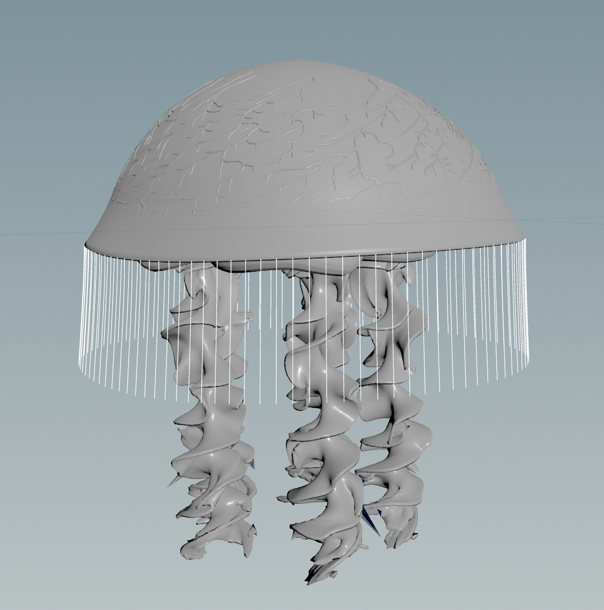
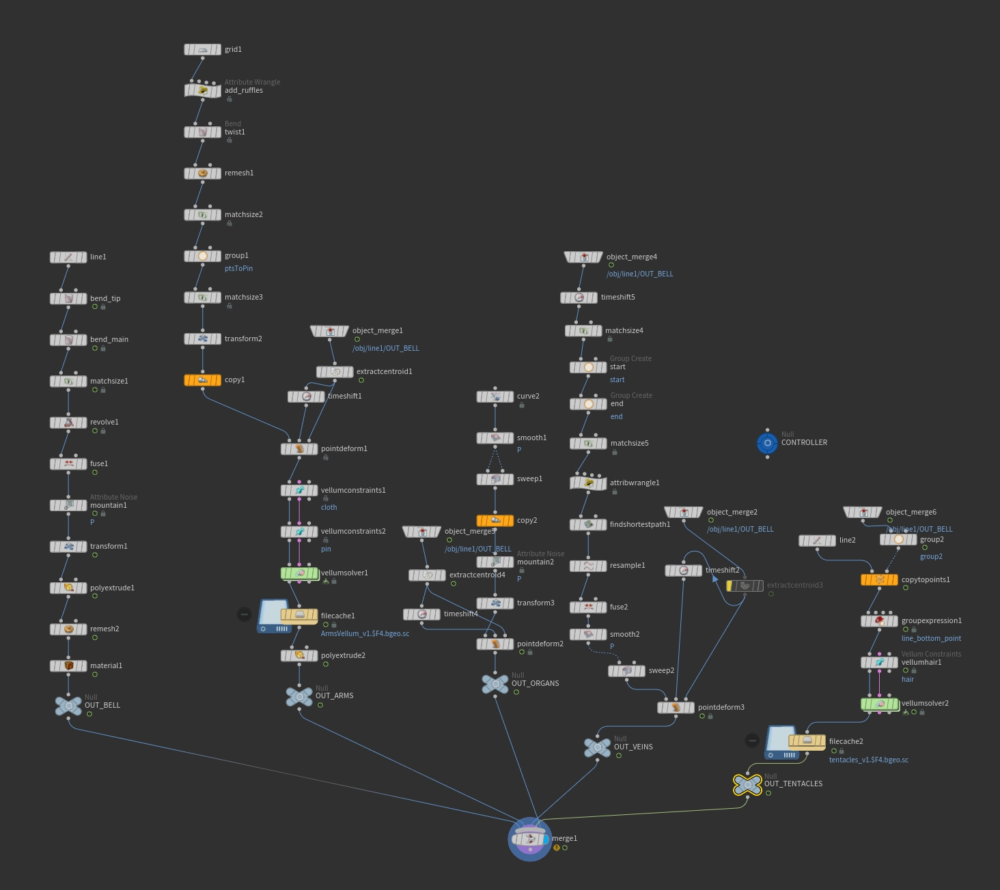
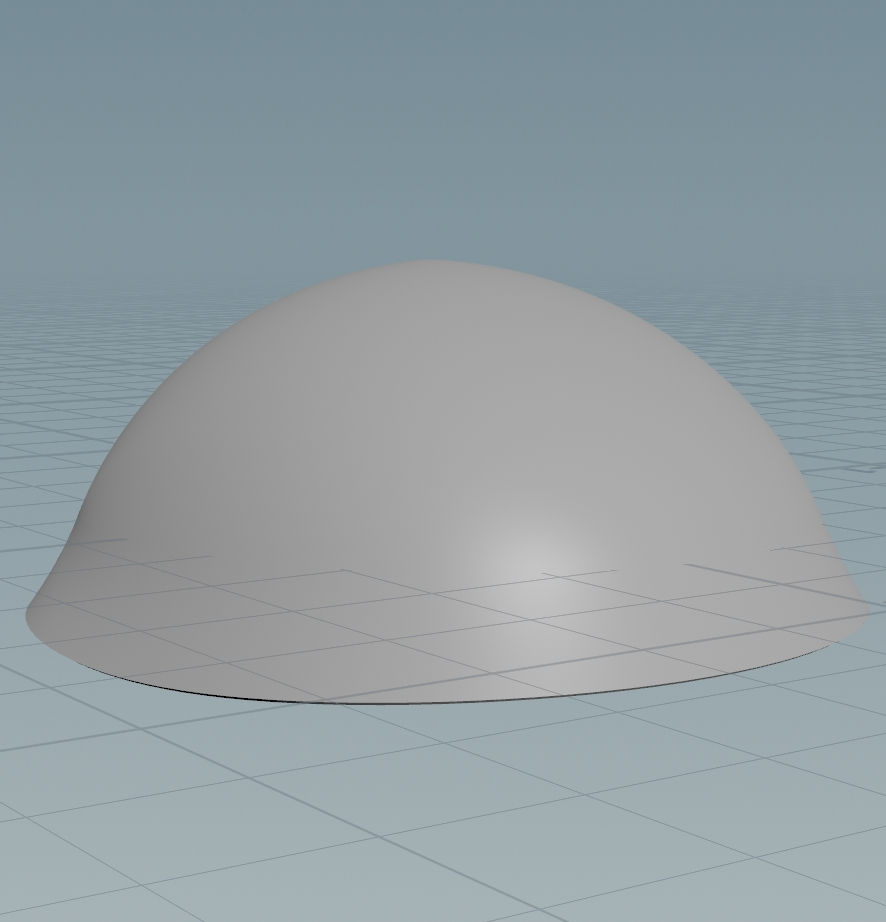
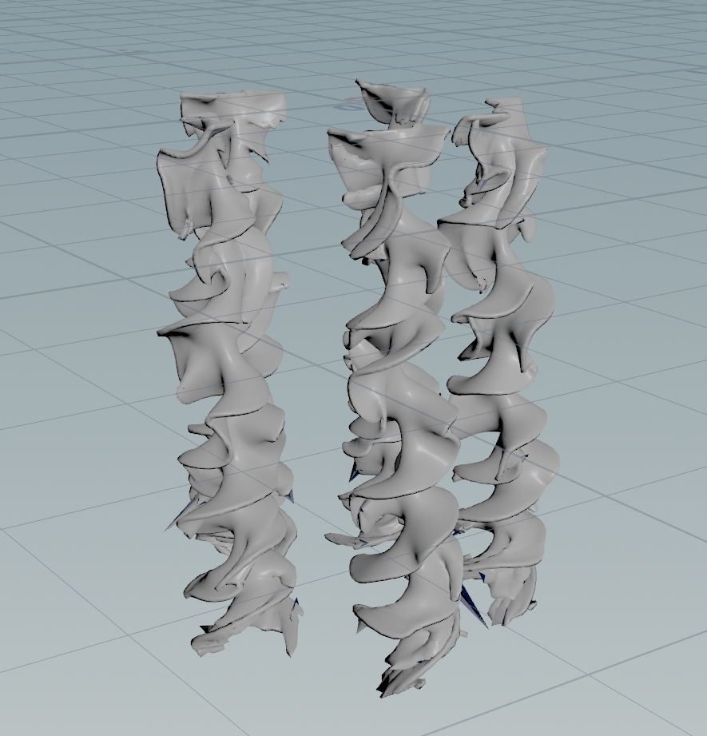
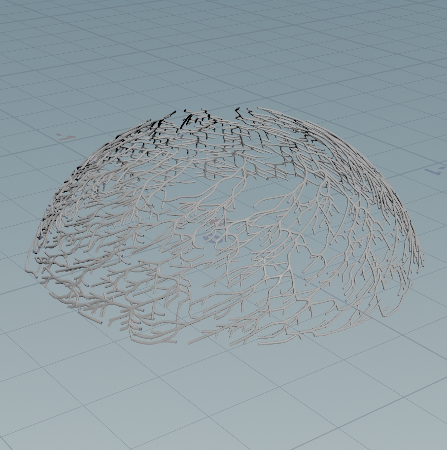
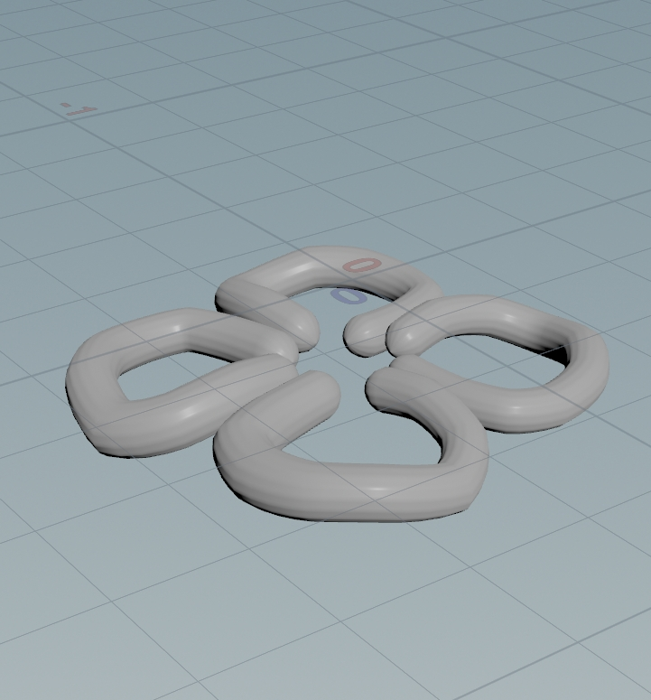
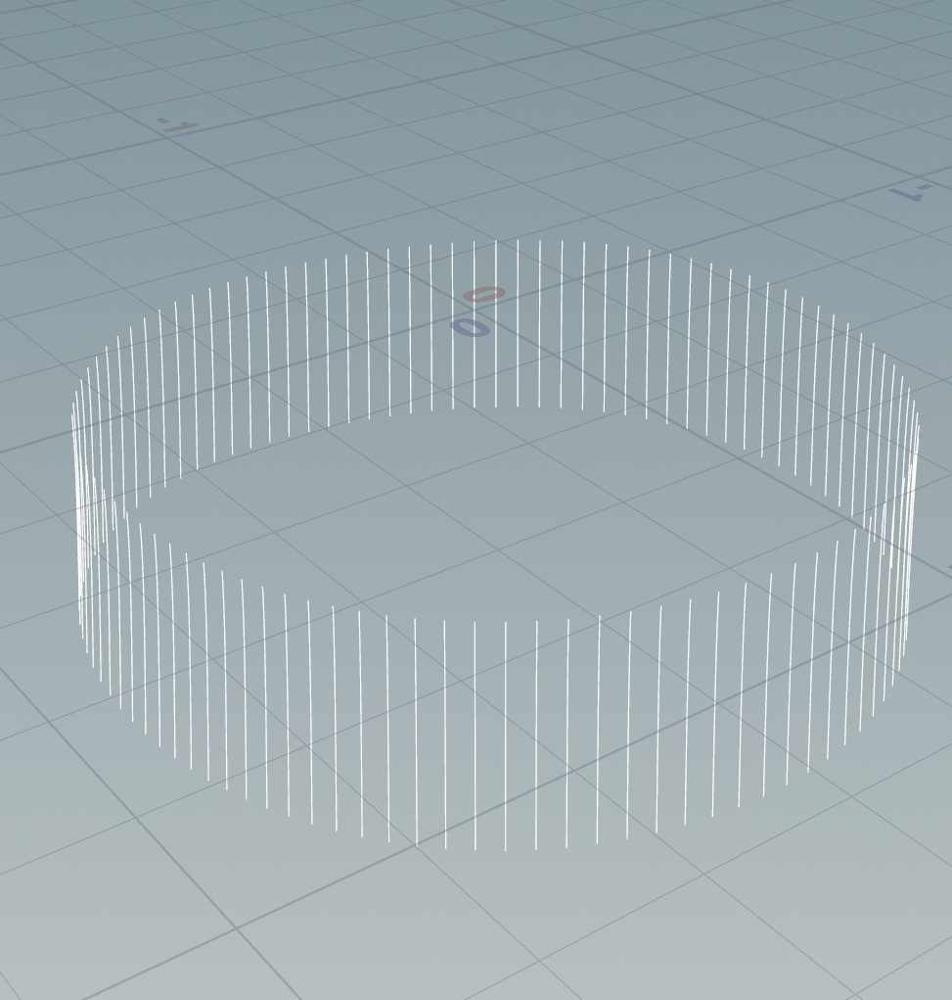

# Procedural Jellyfish

## Project Overview
In this project, I created a procedural jellyfish using Houdini. It gives me a chance to dig into procedural modeling, as well as some simulation.

## Showcase

## Each Part
My approach is as follows:

|Image| Method|
|:---:|:-----:|
| | 1. Start by sketching a line that will later be revolved around the y-axis to form the bell shape. 2. Introduce natural deformation using two Bend nodes—one for shaping the rim and another for adjusting the central part. 3. Animate the bell by keyframing in the timeline. [Video](https://www.youtube.com/watch?v=J3X8BB0yNRE)|
| |1. Set up geometry attributes for the cloth simulation in advance using the Vellum constraint node. 2. Run the actual cloth simulation through the Vellum solver node.[Video](https://www.youtube.com/watch?v=A_oNXqx8XH4)|
| |1. Transform the jellyfish model into triangular meshes, preventing a blocky, square look for the veins. 2. Utilize two groupByRange nodes to mark the start and end points of each branching pattern for the veins. 3. Generate the veins by using the shortest path node. 4. Smooth out the vein structure to make it more organic. Use resample and fuse nodes before applying the "smooth" node to keep the geometry seamless and continuous. 5. Use a sweep node to give the veins some thickness, shaping them as rounded tubes instead of flat strings. 6. Finally, use the "Point Deform" node (as previously used for the arms) to attach the veins to the animated bell.|
|  |1. Begin by drawing a Bezier curve, then apply the sweep node to generate a worm-like shape for the organ. 2.Rotate and duplicate the base shape of the organ to create more elements. 3.Apply the "Mountain" node to introduce noise, adding variations to the mesh.|
|  |1. Isolate the rim points of the jellyfish bell. 2. Use a copytopoints node to scatter lines randomly on selected points from the rim group. 3. Simulate the tentacle movements with vellumconstraints and vellumsolver, utilizing the same method as simulating hair. [Video](https://www.youtube.com/watch?v=LN4XXaHQkmU)|

---

Here are some SideFX docs that you might find helpful:

[Geometry Nodes Documentation](https://www.sidefx.com/docs/houdini/nodes/sop/index.html)

[VEX Documentation](https://www.sidefx.com/docs/houdini/vex/functions/index.html)

## Bell and Arms
Follow along to the videos to create the bell and arms of the jellyfish. Although I provide the values I used to create my jellyfish, you're heavily encouraged to play around and customize the setup to your liking! 

[Jellyfish Bell Setup Video](https://www.youtube.com/watch?v=J3X8BB0yNRE)

[Jellyfish Arms Setup Video](https://www.youtube.com/watch?v=A_oNXqx8XH4)

## Veins
In order to create the veins for the jellyfish, you'll make use of the "Find Shortest Path" node. The Dungeon Corridor example in the Houdini Playground is a helpful reference for using this node. Here is some rough guidance for how to approach making the veins:

Remesh the jellyfish into triangles (otherwise you'll end up with very square looking veins)

Use the shortest path node to generate veins ([here](https://www.sidefx.com/docs/houdini/nodes/sop/findshortestpath.html) are the docs for the Find Shortest Path node)

Smooth out the veins for a more organic look. You might find yourself needing the "resample" and "fuse" nodes in addition to the "smooth" node (and remember, the [docs](https://www.sidefx.com/docs/houdini/nodes/sop/index.html) are a great resource if you're confused about what a node does or how to use it)

Use a "sweep" node to give the veins width

Lastly, stick the veins to the bell's animation using the "Point Deform" node that we used on the arms. The final result should look something like this:

## Organs
Next, create organs for your jellyfish. You can approach this any way you'd like! The final result should look something like this:

## Tentacles
When you're working on Houdini projects in the future, you usually won't be able to find tutorials for exactly what you're trying to do. Instead, you'll need to be able to take semi-related tutorials and apply the relevant techniques to your projects. This exercise is designed to give you some experience with that.

Your goal is to create tentacles that look like this for your jellyfish:

[This video](https://www.youtube.com/watch?v=LN4XXaHQkmU) demonstrates how to simulate hairs to create renders like this:

Your task is to watch the video and extract the applicable information to make the tentacles! (also, just a heads up, the second half of the tutorial is all irrelevant rendering stuff in C4D, so you only need to watch the first 12 minutes or so).

## Houdini FAQ
[File Cache Node](https://www.youtube.com/watch?v=00s9YWDWFs0) - How do I use the File Cache node? Where does it save and how do versions work?

[Simulation Caching](https://www.youtube.com/watch?v=jwIuzB9FkX0) - Why is my timeline turning blue/orange? Why isn't my simulation updating even though I made changes?
