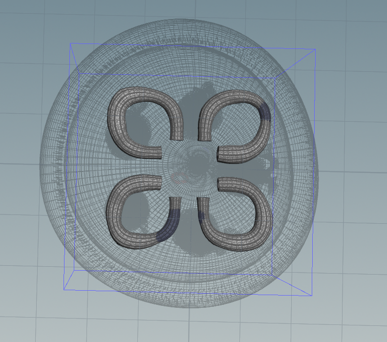

# Procedural Jellyfish

## Project Overview
In order to create the bell and arms, I followed the tutorial videos. I began to experiment when I created the organs since I used a bezier curve to give me an outline of the shape I wanted, which I then used sweep and poly extrude nodes to add some thickness to. I then used a mountain node to make the appearance of the organs less uniform. Lastly, I used mirror nodes in order to create four copies. In order to create the veins, I adapted the node network used in the Procedural Dungeon example to create a start and end group near the top and bottom of the bell respectively. I then plugged these inputs into a shortest path node and used smooth and fuse nodes to make the paths look more organic. I then used a sweep node to extrude the veins. To create the tentacles, I used a copy to points set up with a torus like in the video, but I used ray nodes to change the scale of the tentacles. For extra credit, I also created some longer arms that utilized a group I made of the points lowest on the edge of the bell and a group by range node so that there were fewer arms than tentacles. I orginally wrote some VEX code to genreate lines from the points in the aforementioned group, but I realized that it would be easier to use a copy to points node instead so I took that approach (thank you, Elyssa!).

## Organ Closeup
 
