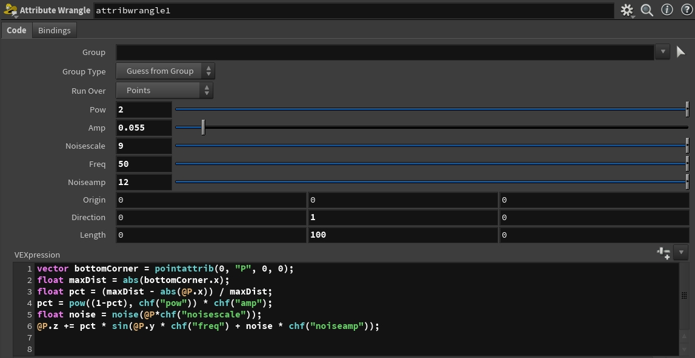
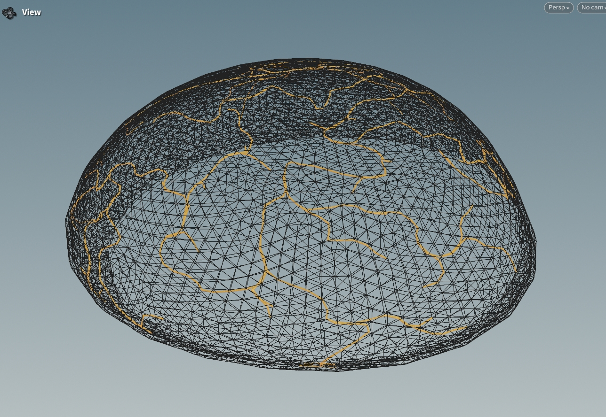
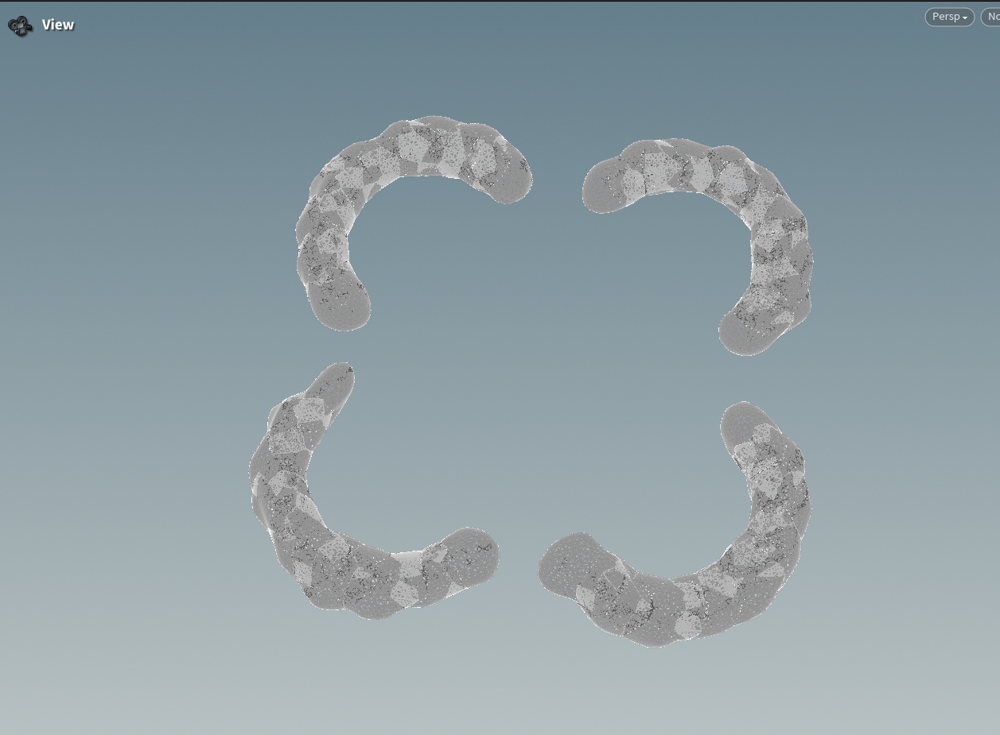
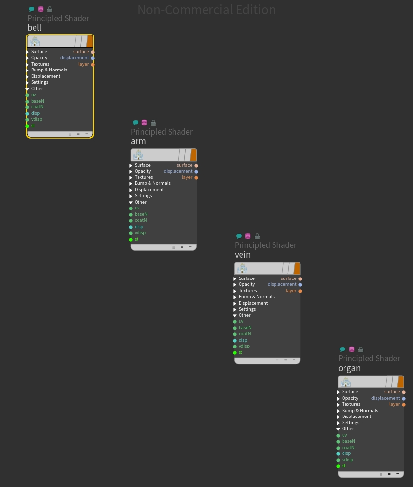

# Procedural Jellyfish
## Result

## Implementation Details
### Bell and Arms
The bell was modeled based on a twice-bent linear line. Once the line bent to the desired shape, the Revolve Node was used to generate the Bell-Like model.
The arms were modeled using a twisted linear line and a noise function. 

### Veins
The veins were created by using the shortest path algorithm applied on the Bell surface edges.

### Organs
The organs were created from a linear twice-bent line as well.

### Extra
- Four different materials assigned to the models

- HDRI background environment
- Mantra animation render scene
