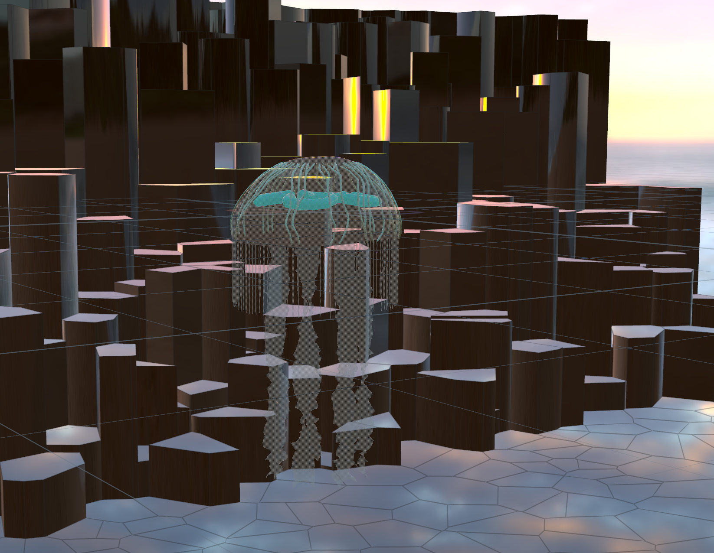

# Procedural Jellyfish

Final result:

## Bell and Arms
Follows the provided tutorial guide. I did some animation in the curve editor.

## Veins
I created two groups using boxes that randomly selected points on the bell within them for start and end points respectively. I used the normal filter option to only select points on the outside of the bell. Then I used the shortest path node, smoothed those paths, and used the sweep node. They kind of clipped into the bell so I made the radius larger and scaled the final vein geometry up a little.

## Organs
I drew a bezier curve, used the sweep node, then repeated the shape four times. I then applied some mountain noise to add variation to the geometry.

## Tentacles
Similarily to the veins I had a group that selected points at the bottom of the bell. They followed the bell movement using point deform and then I copied lines to those points which then had the vellum hair solver run on them.

## Extra Credit
* Render (Mantra)
  * Set up some transparent emissive materials. Added Worley Noise pattern with color shift on top of the bell.
* Custom Rock Background
  * Took a grid, scattered points on the grid, applied voronoi fracture, then extruded. The extent of the extrusion is controlled by a attribute wrangle node: it scales with the coordinate value in the z-axis. Texture are from [here](https://polyhaven.com/a/rock_face_03).
    
