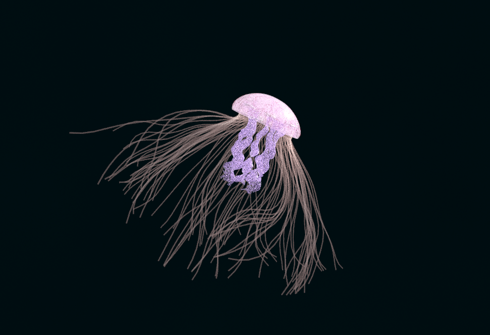

# Procedural Jellyfish

## Zhen Render

## Project Overview
In this homework, I created a procedural jellyfish using Houdini. The jellyfish consists of following components:
- Hat
- Arm
- Organs
- Veins
- Tentacles

### Hat
As for the hat, I used a revolved curve to create the shape. Then, I used some noise to add randomness to the shape. Also, I used a controller to contorl the shape and position of the jellyfish overtime so that I can generate an animation sequence.

### Arm
The arms are twisted planes. I used cloth simulation to simualte the waving effect of arms.

### Organs
The shape of organs are from bended lines. I then used sweep function to generate a tube shape from the curves and added noise to it. Finally, I made 4 copies of the organ and let them animate with the hat

### Veins
Veins are generated from shortest path function. I choose two set of points as start and ends and calculate the path between them. To make the path more random, I turned the hat to the triangle mesh. Another issue I encoutered is that the topology of the hat would change in every frame since the shape of the hat also changes over time. The solution is to use time shift to record the point position in the first frame. Finally, I used point deform to animate these veins with the hat.

### Tentacles
Tentacles are set of lines binded to the hat. I also used the point in the first frame and used hair simulation to animate them.

### Rendering
I added a transparent material to the jellyfish and rendered them with Mantra engine. The video is shown at the top.