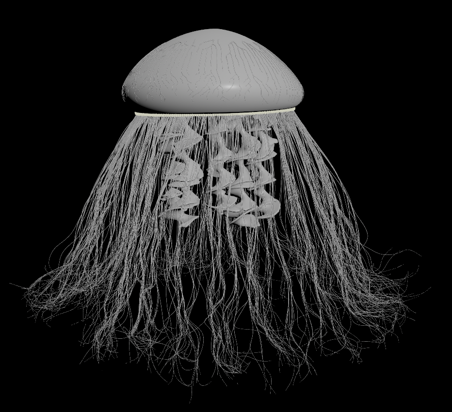
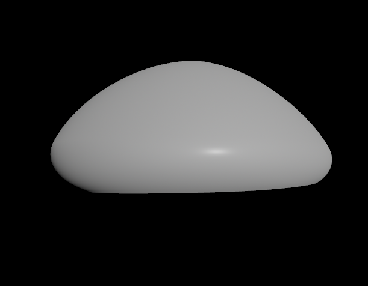
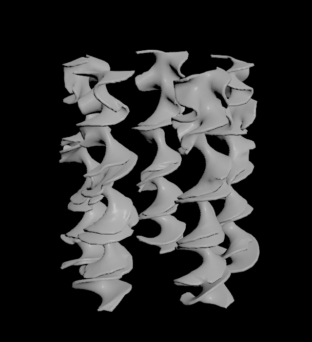
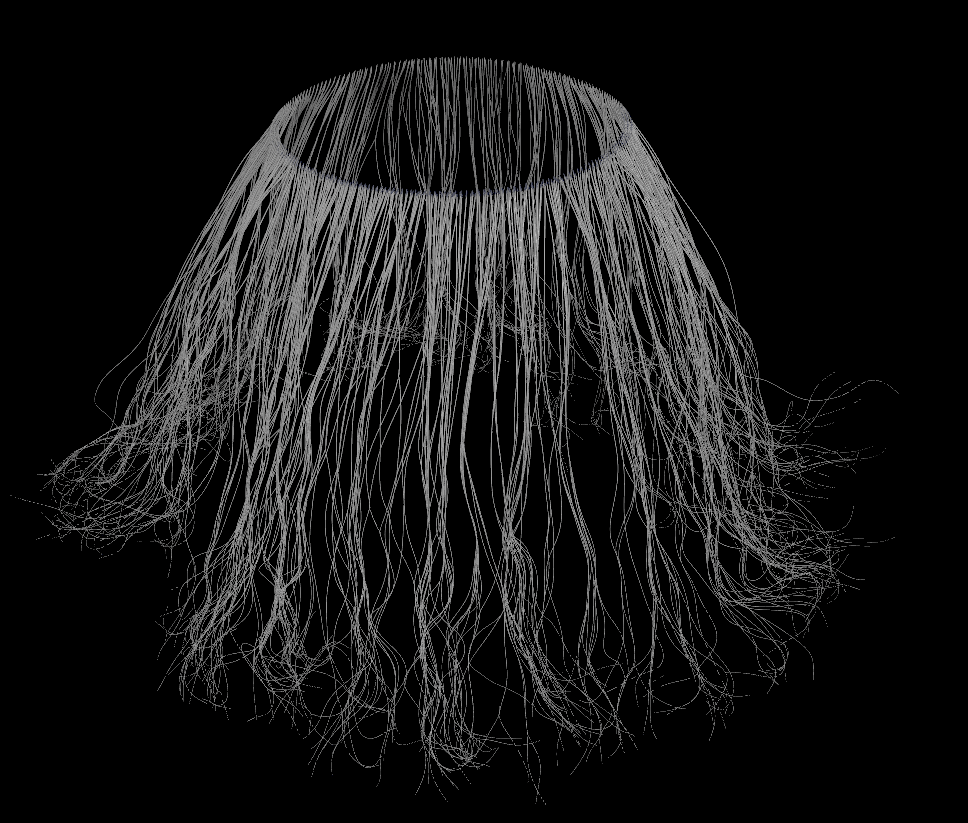

# Procedural Jellyfish
In this project, a procedural jelllyrish is created using Houdini. The jellyfish is mainly made of five parts: the bell, arms, veins, organs, and tentacles. Finally, some basic animation was created for final render. 
## Video
[See Link](https://www.youtube.com/watch?v=HK8lcDc3Dx4)

## Bell

## Arms

## Veins

## Organs

## Tentacles

