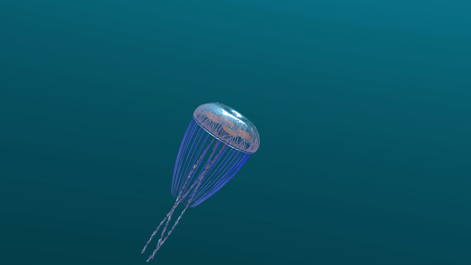

# Procedural Jellyfish

Jellyfish by jasonhl:

- Bell and arms according to video tutorial
- Veins created w/ Find Shortest Path, Smooth, and Sweep nodes
- Organs created w/ Curve, Sweep, and Remesh nodes
- Tentacles created w/ Copy to Points, Group Expression, and Vellum Hair nodes
- Custom materials using Principled Shader nodes

Flipbook video:

Extra credit render (using Mantra):

